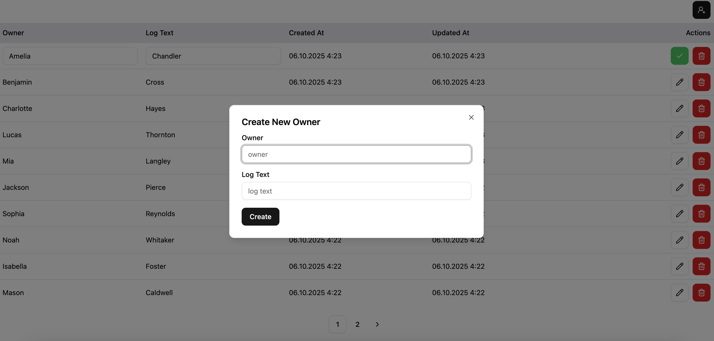
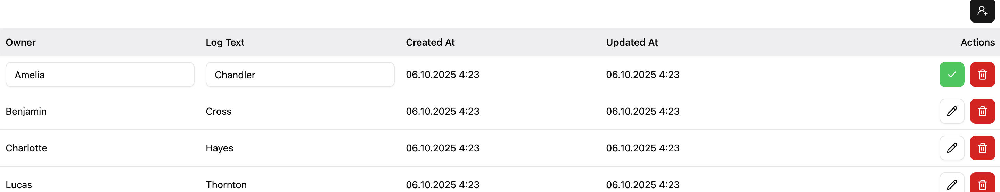
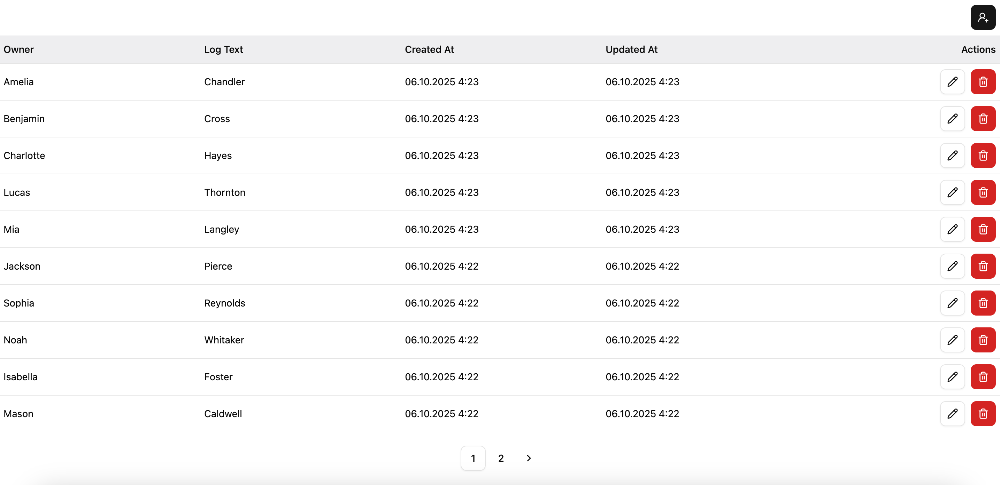

# ⚡ Vite + pnpm App

## This is a simple guide to setting up and running a Vite application using pnpm.

## Project Setup

### 1. Clone the repository:

`git clone https://github.com/RomanShaposhnikov95/frontend.git`

[Frontend](https://github.com/RomanShaposhnikov95/frontend)

### 2. Install dependencies with pnpm:

`pnpm install`

### 3. Run the application

`pnpm dev`

# Backend

## The server uses Express + Prisma. The backend repository can be found here:

`https://github.com/RomanShaposhnikov95/backend`

# 🌐 Deployed Backend

## For convenience, the backend is deployed on a server with a PostgreSQL database:

`https://backend-yrq8.onrender.com`


### ⚠️ Note: Since a free server is used, it goes to sleep when idle. The first load after inactivity may take some time (around a minute).


# Backend API Routes

1. **Get all logs**  
   `GET https://backend-yrq8.onrender.com/logs?page=1&limit=10`

2. **Delete a log by ID**  
   `DELETE https://backend-yrq8.onrender.com/logs/:id`

3. **Update a log by ID**  
   `PUT https://backend-yrq8.onrender.com/logs/:id`  
   **Body (JSON):**
```json
{
  "owner": "string",
  "text": "string"
}
```

4. **Create a new log**  
   `PUT https://backend-yrq8.onrender.com/logs`  
   **Body (JSON):**
```json
{
  "owner": "string",
  "text": "string"
}
```


### 1. Clone the backend (if needed):

`git clone https://github.com/RomanShaposhnikov95/backend` 

[Backend](https://github.com/RomanShaposhnikov95/backend.git)

### 2. Install dependencies with pnpm:

`pnpm install`

### Then run:

`pnpm dev`


# App screenshot






